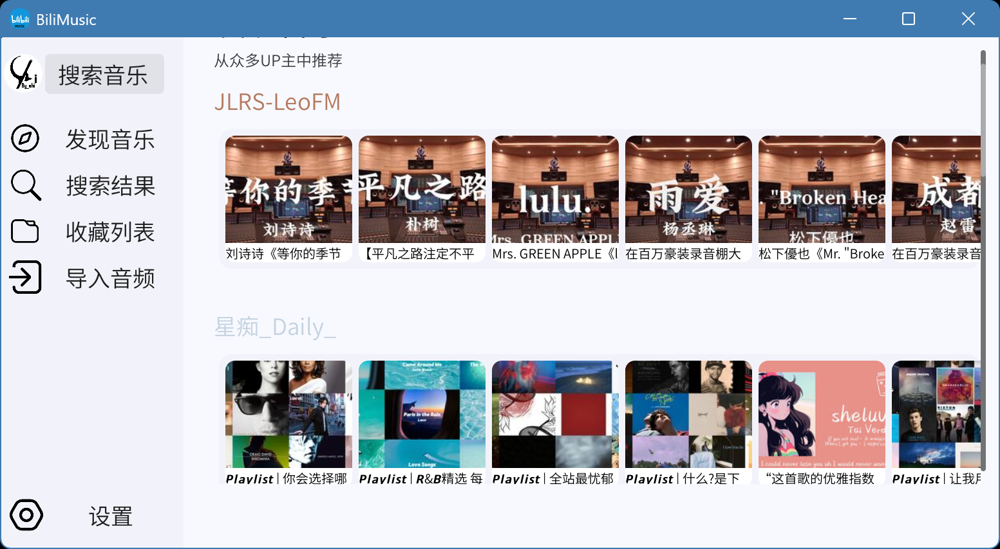
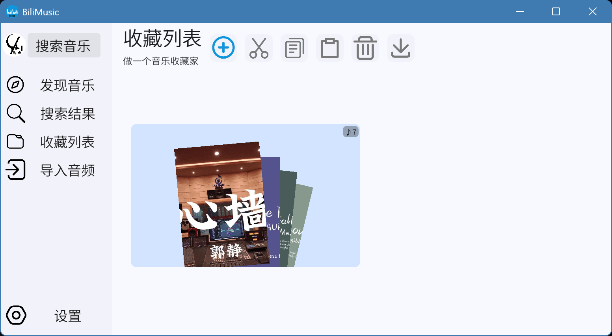

### 项目介绍

BiliMusic 是一个使用 Godot 引擎开发的桌面应用程序，提供直接从哔哩哔哩平台流媒体播放音乐的无缝体验。它结合了 Godot 跨平台的强大功能与 C# 脚本和 GDScript，提供直观且高效的用户界面。

### 主要功能

- 🎶 **从哔哩哔哩流媒体播放**: 直接从哔哩哔哩平台访问和播放音乐内容
- 🖥️ **跨平台支持**: 基于 Godot 开发，支持 Windows、macOS 和 Linux
- ⚡ **轻量级快速**: 高效的性能表现，使用 GDShader 优化渲染
- 🎨 **直观用户界面**: 用户友好的界面，专注于音乐发现和播放
- 📱 **现代体验**: 专为音乐流媒体设计的当代设计风格

### 项目截图



### 技术栈

- **引擎**: Godot
- **主要语言**: C# (60.6%)
- **脚本语言**: GDScript (37.7%)
- **图形着色器**: GDShader (1.7%)

### 系统需求

- Godot Engine 4.x
- .NET Runtime（C# 支持）
- 互联网连接以实现哔哩哔哩流媒体播放

### 安装

#### 从源代码安装
!调试项目一定要更改项目中C:\Users\By.chi\Documents\bili-music\CSharp\Play\AudioConverter.cs里的ffmpeg换成你自己的
1. 克隆仓库：
```bash
git clone https://github.com/By-chi/BiliMusic.git
cd BiliMusic
```
2. 在 Godot Engine 4.x 中打开项目
3. 构建并运行项目

#### 预编译二进制文件

从 [Releases](https://github.com/By-chi/BiliMusic/releases) 页面下载最新版本。

### 使用方法

1. 启动 BiliMusic
2. 使用哔哩哔哩账号登录（如需要）
3. 浏览和搜索音乐
4. 点击播放、创建播放列表，享受音乐！

### 项目结构

```
BiliMusic/
├── src/                 # 源代码
│   ├── csharp/         # C# 脚本
│   ├── gdscript/       # GDScript 文件
│   └── shaders/        # GDShader 文件
├── scenes/             # Godot 场景
├── assets/             # 图片、音频和其他资源
├── project.godot       # Godot 项目配置
└── README.md           # 本文件
```

### 配置

可以在设置面板中调整配置选项。主要选项包括：

- 音频质量偏好设置
- API 端点配置
- UI 主题选择

### API 集成

BiliMusic 与哔哩哔哩 API 集成以获取和流媒体播放音乐。确保在设置中正确配置 API 凭据。

### 开发

#### 前置要求

- Godot 4.x
- .NET SDK（C# 开发）
- Git

#### 从源代码构建

```bash
# 克隆并导航到目录
git clone https://github.com/By-chi/BiliMusic.git
cd BiliMusic

# 在 Godot 编辑器中打开并导出
```

### 贡献

欢迎贡献！请随时提交拉取请求或为 bug 和功能请求开启问题。

### 路线图

- 移动应用版本
- 离线下载支持
- 高级播放列表管理
- 与其他音乐平台集成

### 性能指标

- 平均内存占用: ~[300] MB

### 鸣谢

- 由 [Godot Engine](https://godotengine.org/) 构建
- 音乐数据由哔哩哔哩提供

### 支持

如有问题、疑问或建议：

- 📧 邮箱: [by.chi@outlook.com]
- 🐛 问题追踪: [GitHub Issues](https://github.com/By-chi/BiliMusic/issues)
