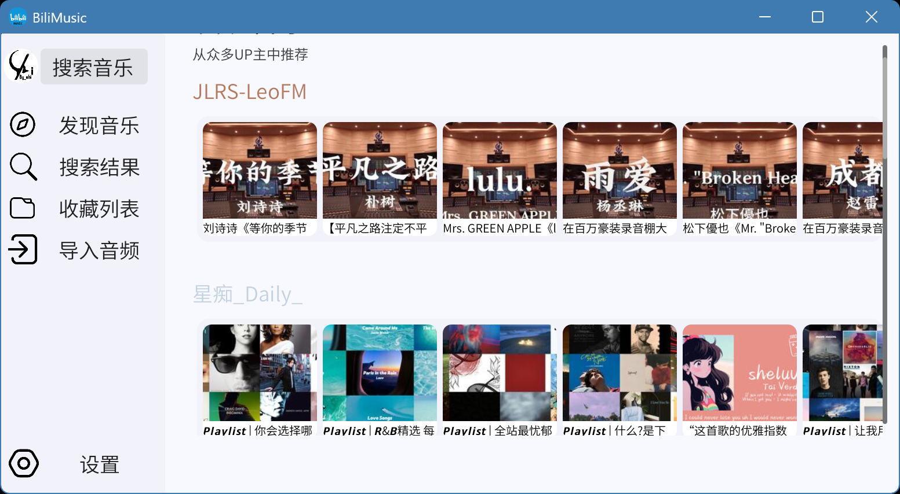
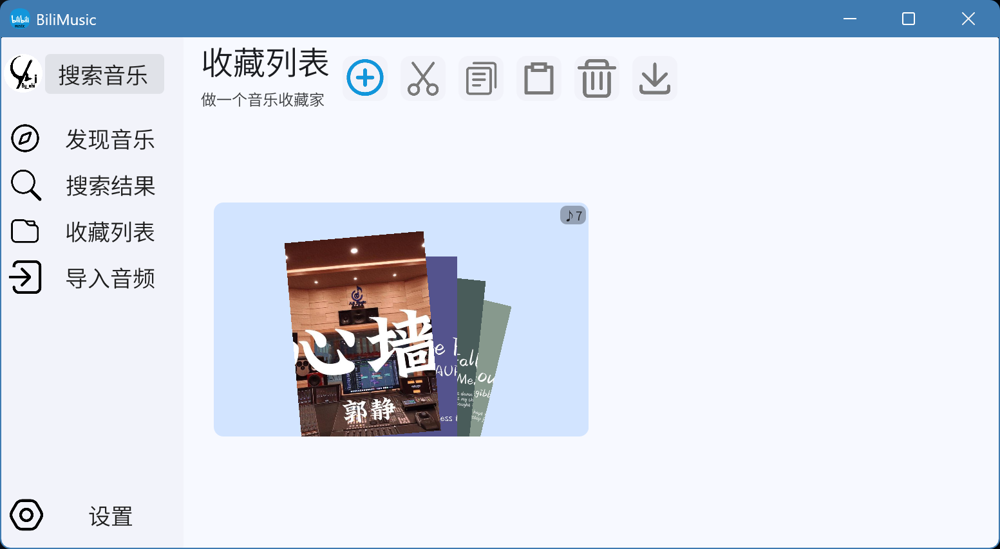
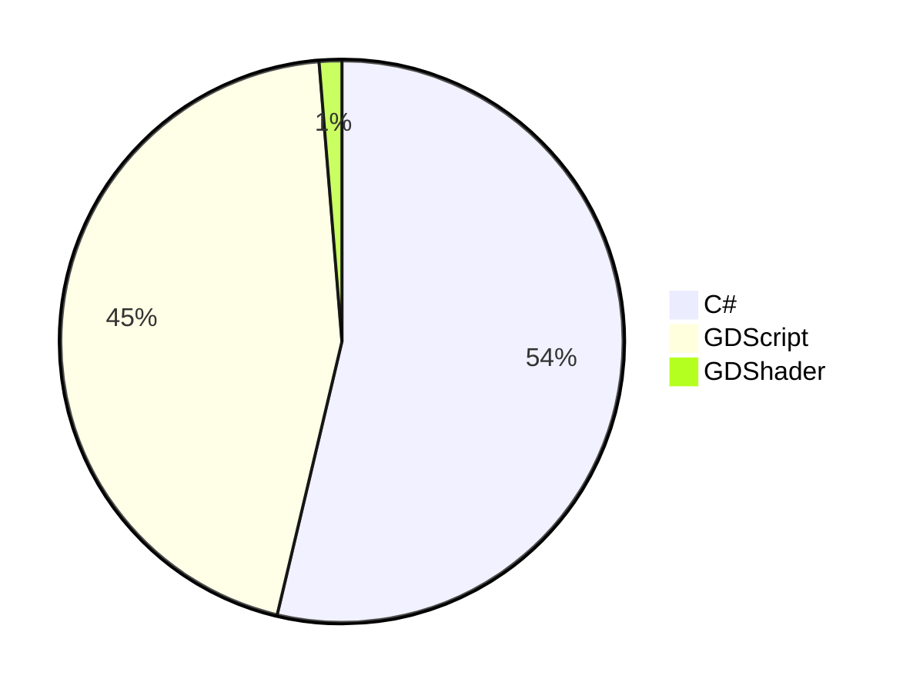

### BiliMusic

> 让音乐变得更方便 Make Music Simpler

`BiliMusic` 是一个使用 `Godot` 引擎开发的桌面应用程序，提供直接从哔哩哔哩平台流媒体播放音乐的无缝体验。它结合了 `Godot` 跨平台的强大功能与 `C#` 脚本和 `GDScript`，提供直观且高效的用户界面。

### 主要功能

- **从Bilibili直接播放**: 直接从哔哩哔哩平台访问和播放音乐内容
- **跨平台支持**: 基于 Godot 开发，支持 Windows、macOS 和 Linux
- **轻量级快速**: 高效的性能表现，使用 GDShader 优化渲染
- **直观用户界面**: 用户友好的界面，专注于音乐发现和播放
- **现代体验**: 专为音乐流媒体设计的当代设计风格

### 项目截图



### 技术栈

```mermaid
pie
    "C#" : 53.7
    "GDScript" : 45
    "GDShader" : 1.3
```

### 系统需求

- `Godot Engine 4.x mono` $\rightarrow$ `GDScript运行支持`
- `.NET Runtime` $\rightarrow$ `C#运行支持`
- `互联网连接` $\rightarrow$ `BiliBili访问支持`

### 安装

#### 从源代码安装
> $!\space>$ 重要提示 $<\space!$
> 当`调试项目`时，请更改项目中
> `CSharp\Play\AudioConverter.cs`
> `DebugFfmpegPath`与`DebugFfprobePath`常量字段为实际位置
> ```csharp
> #if DEBUG
>     private const string DebugFfmpegPath = @"D:\MSYS2\home\By.chi\ffmpeg-master\ffmpeg.exe";
>     private const string DebugFfprobePath = @"D:\MSYS2\home\By.chi\ffmpeg-master\ffprobe.exe";
> #endif
> ```

1. 克隆仓库：
```bash
git clone https://github.com/By-chi/BiliMusic.git
cd BiliMusic
```
2. 在 `Godot Engine 4.x mono` 中打开项目
3. 构建并运行项目

#### 从预编译二进制文件
 从[最新版本](https://github.com/By-chi/BiliMusic/releases)页面获取`Mac`或`Windows`版本

### 使用方法
> $!\space>$ 重要提示 $<\space!$
> 如非特殊需求，否则`强烈建议`使用哔哩哔哩账号登录，会带来更好的使用体验与更少的`412`风控报错!
1. `启动 BiliMusic`
2. `使用哔哩哔哩账号登录（如需要）`
3. `浏览和搜索音乐`
4. `点击播放、创建播放列表，享受音乐！`

### 配置

可以在设置面板中调整配置选项。主要选项包括：

- 音频质量偏好设置
- UI 主题选择

### 开发

#### 前置要求

- Godot 4.x
- .NET SDK（C# 开发）
- Git

#### 从源代码构建

```bash
# 克隆并导航到目录
git clone https://github.com/By-chi/BiliMusic.git
cd BiliMusic

# 在 Godot 编辑器中打开并导出
```

### 关于贡献

欢迎贡献！可随时提交`Pull Requese`或为`bug`/`Feature`提交`Issues`。

### 路线图

- 移动应用版本
- 离线下载支持
- 高级播放列表管理
- 与其他音乐平台集成

### 性能指标

- 平均内存占用: ~[300] MB

### 鸣谢

- 由 [Godot Engine](https://godotengine.org/) 构建
- 音乐数据由哔哩哔哩提供

### 支持

如有问题、疑问或建议：

- `邮箱`$:$ 
- > [by.chi](mailto:by.chi@outlook.com)
- > [GeekApple](mailto:huangyuguang2013@163.com)
- `Bug`$:$
- > [GitHub Issues](https://github.com/By-chi/BiliMusic/issues)
- > [Pull Requests](https://github.com/By-chi/BiliMusic/pulls)